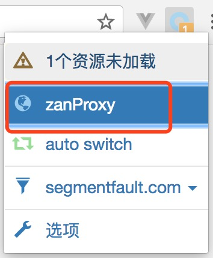

# chrome代理配置

1. 安装chrome代理设置插件 [SwitchyOmega](https://chrome.google.com/webstore/detail/proxy-switchyomega/padekgcemlokbadohgkifijomclgjgif?hl=en-US)
2. 进入SwitchyOmega的配置页，新建情景模式。

3.设置情景模式的代理协议为HTTP，代理服务器为`127.0.0.1`，端口为ZanProxy的代理端口，默认为`8001`

4. 当需要使用ZanProxy代理请求时，将SwitchyOmega选择为你为ZanProxy设置的情景模式。

